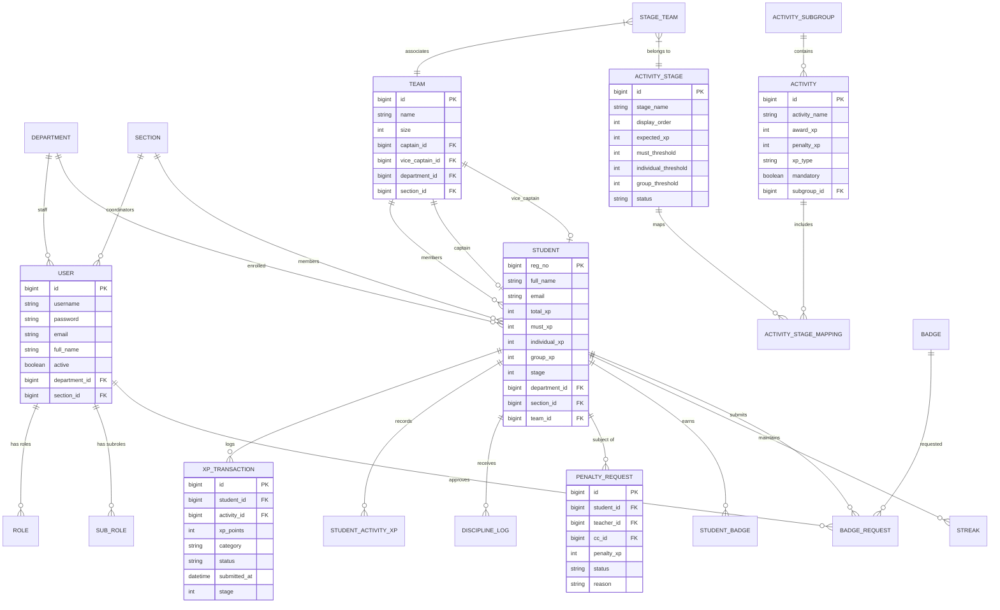
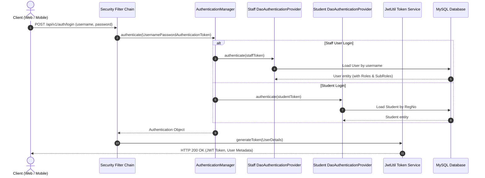
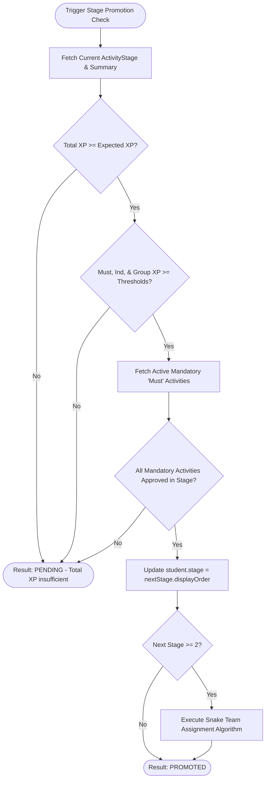
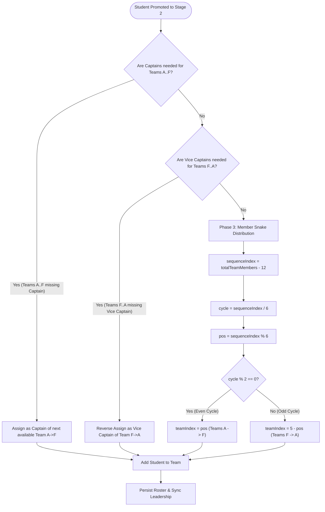

# PragatiX System Design Document
**Gamified Student Performance and Development Management System (SPDMS)**  
*J.J. College of Engineering and Technology (JJCET)*

---

## 1. Overview

### System Purpose and Scope
PragatiX is an enterprise-grade, gamified Student Performance and Development Management System (SPDMS) custom-built for J.J. College of Engineering and Technology (JJCET). The platform shifts student development away from static academic tracking toward a continuous, multi-stage growth journey powered by Experience Points (XP), streak mechanics, digital badges, dynamic team formation, and automated discipline governance. Built on Spring Boot 3.3.1 (Java 21) and MySQL 8.0, PragatiX enforces real-time stage promotion validation, automated team snake-assignment algorithms, attendance tracking, and role-based administrative workflows across all academic departments.

### Core Actors
1. **Students:** Primary users who complete activities, track XP progression, unlock growth stages, participate in stage teams, maintain activity streaks, submit badge requests, and view departmental/overall leaderboards.
2. **Faculty / Teachers:** Log daily attendance, submit activity completions, award/deduct XP points, and initiate penalty requests for discipline breaches.
3. **Class Coordinators (CC):** Section-level academic managers who approve/reject student badge requests, review teacher-initiated penalty requests in a dedicated inbox, and monitor section performance.
4. **Heads of Department (HOD):** Department-level administrators who monitor department-wide XP distribution, year-wise academic trends, and staff activity compliance.
5. **Admins:** Institutional managers responsible for activity catalog configuration, stage threshold definitions, subject/section creation, user role provisioning, and team oversight.
6. **Super Admins / Year Admins:** High-privilege operators managing cross-departmental operations, academic year transitions, and global system configurations.
7. **System / Engine Schedulers:** Automated background services (`StageLifecycleScheduler`, `AttendanceCronScheduler`, `CaptainRewardCronScheduler`) that execute nightly stage promotions, streak decay, and leadership sync.

---

## 2. High-Level Architecture

### System Component Architecture

```mermaid
flowchart TD
    subgraph Client Layer
        WebClient["Web Client (React / Vite)"]
        MobileClient["Mobile Client (Flutter / Dart)"]
    end

    subgraph AWS Infrastructure
        CloudFront["AWS CloudFront CDN"]
        S3Bucket["AWS S3 Static Web Hosting"]
        Route53["AWS Route 53 DNS"]
        ACM["AWS Certificate Manager (SSL)"]
        EC2["AWS EC2 Instance (Ubuntu 22.04 LTS)"]
    end

    subgraph Backend Application (Spring Boot 3.3.1 / Java 21)
        SecurityFilter["Security Filter Chain (JWT, Bucket4j, Jsoup, IP Block)"]
        Controllers["REST Controllers (Spring MVC)"]
        
        subgraph Domain Modules
            XpEngine["XP Engine & Progression"]
            StageModule["Stage Validation & Promotion"]
            TeamModule["Snake Team Assignment"]
            DisciplineModule["Discipline & Penalty Workflow"]
            AttendanceModule["Attendance Engine & Streaks"]
            BadgeModule["Badge Management"]
        end

        DataJPA["Spring Data JPA / Hibernate ORM"]
    end

    subgraph Database Layer
        MySQL[("MySQL 8.0 Database")]
    end

    subgraph External Integrations
        Twilio["Twilio SMS Gateway"]
    end

    WebClient -->|HTTPS| CloudFront
    MobileClient -->|HTTPS| Route53
    CloudFront --> S3Bucket
    Route53 --> ACM
    CloudFront -->|API Proxy| EC2
    EC2 --> SecurityFilter
    SecurityFilter --> Controllers
    Controllers --> XpEngine
    Controllers --> StageModule
    Controllers --> TeamModule
    Controllers --> DisciplineModule
    Controllers --> AttendanceModule
    Controllers --> BadgeModule
    
    XpEngine --> DataJPA
    StageModule --> DataJPA
    TeamModule --> DataJPA
    DisciplineModule --> DataJPA
    AttendanceModule --> DataJPA
    BadgeModule --> DataJPA

    DataJPA -->|JDBC Connection Pool| MySQL
    AttendanceModule -->|SMS Notifications| Twilio
```

### Request Flow
1. **Static Content Delivery:** The browser or mobile web client requests static web assets hosted on **AWS S3**, distributed globally via **AWS CloudFront CDN**.
2. **DNS & Security Termination:** API requests target `api.pragatix.in`, resolved by **AWS Route 53** with TLS 1.3 encryption terminated at the load balancer / EC2 nginx reverse proxy via **AWS Certificate Manager (ACM)**.
3. **Application Gateway & Security Filters:** Incoming requests hit the Spring Boot application on **AWS EC2** and pass sequentially through four security filters:
   - `IpBlockingFilter`: Checks client IP against blacklisted address ranges.
   - `RateLimitingFilter`: Enforces Bucket4j token bucket rate limits per client IP.
   - `InputSanitizationFilter`: Uses Jsoup to clean XSS vectors from input bodies/parameters.
   - `JwtAuthFilter`: Extracts the HTTP `Authorization: Bearer <JWT>` header, validates the signature via JJWT (`0.12.5`), and populates `SecurityContextHolder`.
4. **Controller & Business Logic Execution:** Spring MVC routes requests to module-specific `@RestController` classes. Services execute transactional business rules (e.g. `XpEngineService.awardXp()`, `TeamAssignmentService.assignTeamOnPromotion()`).
5. **Persistence Layer:** JPA repositories interact with the **MySQL 8.0** database via HikariCP connection pooling.
6. **Background Scheduling & External Notifications:** Asynchronous events trigger `TwilioSmsService` for parent SMS alerts, while cron jobs execute nightly stage evaluations.

---

## 3. Backend Module Breakdown

### Package Structure (`com.pragatix.*`)

| Package Path | Primary Responsibility |
|---|---|
| `com.pragatix.config` | OpenAPI / Swagger UI configuration (`SwaggerConfig`). |
| `com.pragatix.entity` | 49 JPA entity definitions mapping relational tables. |
| `com.pragatix.repository` | Core Spring Data JPA repositories for root entities. |
| `com.pragatix.scheduler` | System schedulers for automated stage evaluation (`StageLifecycleScheduler`). |
| `com.pragatix.infrastructure.security` | Low-level security filters (`IpBlockingFilter`, `RateLimitingFilter`, `InputSanitizationFilter`). |
| `com.pragatix.modules.academiccalendar` | Academic years, months, weeks, and holiday management. |
| `com.pragatix.modules.activity` | Activity master catalog, subgroup mappings, and stage category definitions. |
| `com.pragatix.modules.admin` | Admin dashboards, user management, activity assignments, and master data lookups. |
| `com.pragatix.modules.analytics` | High-level analytics dashboards, attendance metrics, and XP distribution charts. |
| `com.pragatix.modules.attendance` | Attendance sessions, daily/weekly engines, streak tracking, and captain rewards. |
| `com.pragatix.modules.attendancesettings` | Attendance cutoff rules, grace period parameters, and engine clock configuration. |
| `com.pragatix.modules.authentication` | JWT generation/validation, custom user details services, and Spring Security configuration. |
| `com.pragatix.modules.badge` | Badge definitions, badge requests, and approval workflow processing. |
| `com.pragatix.modules.cc` | Class Coordinator (CC) inbox, section dashboards, and badge request approvals. |
| `com.pragatix.modules.faculty` | Faculty user management and department mappings. |
| `com.pragatix.modules.leaderboard` | Overall, stage-wise, department, and section leaderboard queries. |
| `com.pragatix.modules.notification` | SMS notifications via Twilio and template management. |
| `com.pragatix.modules.profile` | User and student self-service profile updates. |
| `com.pragatix.modules.student` | Core student lifecycle: XP engine, stage promotion, team assignment, discipline, Excel import. |
| `com.pragatix.modules.superadmin` | Academic year assignments and cross-departmental operations. |
| `com.pragatix.modules.team` | Team master data, captain/vice-captain sync, and team cleanup services. |
| `com.pragatix.modules.xp` | Transaction logs and manual point adjustment workflows. |

---

### Major Domain Deep Dives

#### 1. XP Engine & Progression
- **Entities Involved:** `Student`, `Activity`, `StudentActivityXp`, `XpTransaction`, `ActivitySubgroup`.
- **Key Services:** `XpEngineService`, `StudentXpService`, `StudentXpValidator`, `StudentXpAggregator`.
- **Main Endpoints:**
  - `POST /api/v1/students/{id}/award-xp` (Award or deduct XP)
  - `GET /api/v1/students/{id}/xp-history` (Retrieve XP transaction logs)
  - `GET /api/student/xp` (Student self-service XP dashboard)
- **Business Rules:**
  - **Category Classification:** Awarded XP dynamically splits into three buckets: **Must XP** (`activity.isMustXpEligible()`), **Individual XP** (`activity.isIndividualXpEligible()`), and **Group XP** (`activity.isGroupXpEligible()`).
  - **Grading Mechanics:** Partial points are permitted for reward awards up to `activity.getAwardXp()`. Penalties strict-enforce the full penalty value (`-Math.abs(configuredXp)`).
  - **Audit Logging:** Every XP change creates an immutable `XpTransaction` record with status `APPROVED`, capturing `approvedBy`, `stage`, `isPenalty`, and `submittedAt`.

#### 2. Growth Stages & Promotion
- **Entities Involved:** `ActivityStage`, `ActivityStageMapping`, `Student`, `Level`.
- **Key Services:** `StageValidationService`, `StudentStageFacade`, `StageXpSummaryService`, `StageLifecycleScheduler`.
- **Main Endpoints:**
  - `GET /api/v1/students/{id}/stage-summary` (Stage progression breakdown)
  - `GET /api/admin/stages` (Stage threshold configuration)
  - `POST /api/v1/students/{id}/evaluate-promotion` (Trigger promotion check)
- **Business Rules:**
  - **Threshold Criteria:** A student qualifies for stage promotion when all 4 conditions pass:
    1. `totalXp >= expectedXp`
    2. `mustXp >= mustThreshold`
    3. `individualXp >= individualThreshold`
    4. `groupXp >= groupThreshold`
  - **Mandatory Checklist Validation:** All active `Reward` activities mapped to the `Must` subgroup for that stage must have at least one approved completion without duplicate activity IDs.
  - **State Lock:** Promoted students advance `student.stage` to `nextStage.displayOrder`. Completed stages become `COMPLETED` (locked & read-only); the active stage is `ACTIVE`.

#### 3. Teams & Snake Assignment
- **Entities Involved:** `Team`, `StageTeam`, `Student`, `User`.
- **Key Services:** `TeamAssignmentService`, `CaptainSelectionService`, `LeadershipSyncService`, `TeamCleanupService`.
- **Main Endpoints:**
  - `GET /api/admin/teams` (View active stage teams)
  - `GET /api/admin/teams/{id}/members` (List team roster)
- **Business Rules:**
  - **Stage 2+ Lineage:** Initial team formation occurs upon promotion to Stage 2. Stage 3+ preserves base team names (`Stage 3 - Team A` derived from `Stage 2 - Team A`).
  - **Team Capacity:** Hard cap of **10 members per team**.
  - **Dynamic Leadership Sync:** The first student promoted to a new team becomes **Captain**; the second becomes **Vice Captain**. If a Captain is promoted to a higher stage or removed, `CaptainSelectionService` automatically re-evaluates and promotes the next eligible member.

#### 4. Red Alert Protocol & Discipline Workflow
- **Entities Involved:** `PenaltyRequest`, `DisciplineLog`, `Student`, `User`.
- **Key Services:** `PenaltyWorkflowService`, `StudentDisciplineService`.
- **Main Endpoints:**
  - `POST /api/v1/students/penalty` (Teacher submits penalty request)
  - `GET /api/v1/cc/penalties/inbox` (Class Coordinator inbox)
  - `POST /api/v1/cc/penalties/{id}/approve` (CC approves penalty)
  - `POST /api/v1/cc/penalties/{id}/reject` (CC rejects penalty)
- **Business Rules:**
  - **Auto-Approval:** If the submitting teacher is the student's assigned **Class Coordinator (CC)** (matching section and department), the penalty status is set to `AUTO_APPROVED` and XP is deducted immediately.
  - **Inbox Approval:** Non-CC teacher requests are set to `PENDING` and routed to the assigned CC's inbox for review. Approved requests trigger negative XP deduction via `XpEngineService`.

---

## 4. Data Model (Entity Relationship Diagram)



---

## 5. API Surface

| Method | Endpoint Path | Purpose | Required Auth Role |
|---|---|---|---|
| `POST` | `/api/v1/auth/login` | Staff / User authentication (JWT issue) | Public |
| `POST` | `/api/v1/auth/student-login` | Student authentication via Register Number | Public |
| `GET` | `/api/v1/profile/me` | Fetch currently authenticated user profile | Authenticated |
| `GET` | `/api/v1/students/me` | Fetch authenticated student profile & stage stats | `ROLE_STUDENT` |
| `POST` | `/api/v1/students` | Create new student record | `ROLE_ADMIN`, `ROLE_TEACHER` |
| `PUT` | `/api/v1/students/{id}` | Update existing student record | `ROLE_ADMIN`, `ROLE_TEACHER` |
| `GET` | `/api/v1/students/{id}` | Get student details by ID | `ROLE_ADMIN`, `ROLE_TEACHER`, `ROLE_STUDENT` |
| `POST` | `/api/v1/students/{id}/award-xp` | Award or deduct XP for a student | `ROLE_ADMIN`, `ROLE_TEACHER` |
| `GET` | `/api/v1/students/{id}/stage-summary` | Get detailed stage breakdown & thresholds | `ROLE_ADMIN`, `ROLE_TEACHER`, `ROLE_STUDENT` |
| `POST` | `/api/v1/students/penalty` | Submit discipline penalty request | `ROLE_TEACHER`, `ROLE_ADMIN` |
| `GET` | `/api/v1/cc/penalties/inbox` | View pending section penalty requests | Class Coordinator (`CC`) |
| `POST` | `/api/v1/cc/penalties/{id}/approve` | Approve pending penalty request | Class Coordinator (`CC`) |
| `POST` | `/api/v1/cc/penalties/{id}/reject` | Reject pending penalty request | Class Coordinator (`CC`) |
| `POST` | `/api/v1/students/badge-requests` | Student submits badge verification request | `ROLE_STUDENT` |
| `GET` | `/api/v1/cc/badge-requests` | List section badge requests for approval | Class Coordinator (`CC`) |
| `POST` | `/api/v1/cc/badge-requests/{id}/approve` | Approve badge request and issue badge | Class Coordinator (`CC`) |
| `GET` | `/api/leaderboard/overall` | Fetch global institutional leaderboard | Authenticated |
| `GET` | `/api/leaderboard/department/{deptId}`| Fetch department-specific leaderboard | Authenticated |
| `GET` | `/api/v1/analytics/dashboard` | View top-level system metrics | `ROLE_ADMIN`, `ROLE_SUPER_ADMIN` |

---

## 6. Security Architecture

### Authentication & Authorization Flow
PragatiX enforces a stateless, token-based security architecture using **Spring Security** and **JJWT 0.12.5**.



### Protection Filters
1. **`IpBlockingFilter`:** Intercepts raw requests to reject blacklisted IP addresses.
2. **`RateLimitingFilter`:** Integrates **Bucket4j (8.10.1)** to enforce IP-based rate limiting, protecting auth and heavy API endpoints against Denial of Service (DoS) attacks.
3. **`InputSanitizationFilter`:** Uses **Jsoup (1.17.2)** to strip malicious HTML/JS payloads from request body parameters, mitigating Cross-Site Scripting (XSS).
4. **`JwtAuthFilter`:** Validates JWT signature, claims, and expiration. Populates `SecurityContextHolder` with `GrantedAuthority` collections (e.g. `ROLE_ADMIN`, `ROLE_TEACHER`, `ROLE_STUDENT`, `CC`, `HOD`).

### CORS Configuration
Configured in `SecurityConfig.java` reading from the `CORS_ALLOWED_ORIGINS` environment variable:
- **Allowed Origin Patterns:** Configured via `CorsConfiguration.setAllowedOriginPatterns()`. Explicitly parses comma-separated origins from `.env` while enforcing default fallbacks:
  - `https://pragatix.in`
  - `https://www.pragatix.in`
  - `http://localhost:8080`
  - `http://localhost:5173`
  - `http://localhost:*`
- **Allowed Methods:** `GET`, `POST`, `PUT`, `PATCH`, `DELETE`, `OPTIONS`.
- **Exposed Headers:** `Authorization`.
- **Credentials Policy:** `setAllowCredentials(true)` enabled dynamically when no un-patterned `*` origin wildcard is present.

---

## 7. Infrastructure & Deployment

### AWS Infrastructure Architecture
- **AWS Route 53:** Manages DNS routing for `pragatix.in` and API subdomains.
- **AWS CloudFront:** Serves web application assets with low latency and SSL caching.
- **AWS S3:** Host bucket for production React static bundle builds (`dist/`).
- **AWS EC2:** Runs the Spring Boot 3.3.1 executable JAR as a `systemd` service behind Nginx.
- **AWS Certificate Manager (ACM):** Manages automated TLS/SSL certificate renewal.
- **AWS CloudWatch Agent:** Collects backend application logs (`spdms-backend.logrotate`) and system metrics via `amazon-cloudwatch-agent-snippet.json`.

### GitHub Actions CI/CD Pipeline
Deployment is fully automated across three independent pipeline workflows in `.github/workflows`:
1. `01-backend-ci.yml`: Executes Maven clean/compile, JUnit 5 unit tests with an ephemeral H2/MySQL database, JaCoCo coverage analysis, Checkstyle/PMD/SpotBugs linting, and packages the executable JAR artifact.
2. `02-backend-security.yml`: Performs Gitleaks secret scanning, Semgrep SAST, CodeQL security analysis, OWASP Dependency-Check, Trivy vulnerability scanning, Syft SBOM generation, and builds the HTML security dashboard.
3. `03-backend-deploy.yml`: Provisions an ephemeral MySQL 8.0 service container, runs integration tests, packages the JAR, and automates AWS deployment via OIDC.

---

## 8. Gamification Logic (Core IP Claim)

### 1. XP Award Engine Logic
The XP Award Engine (`XpEngineService.java`) governs all point accumulation, partial grading, and category allocation.

$$\text{Applied XP} = \begin{cases} 
-\lvert \text{Configured XP} \rvert & \text{if Penalty} \\
\min(\text{Request XP}, \text{Configured XP}) & \text{if Award (Partial grading enabled)} 
\end{cases}$$

```java
// Logic excerpt from XpEngineService.java
if (penaltyFlag) {
    appliedXp = -Math.abs(configuredXp);
} else {
    appliedXp = Math.abs(configuredXp);
    if (requestXp > 0 && requestXp < configuredXp) {
        appliedXp = requestXp; // Partial grading for awards
    }
}

// Category Distribution
if (activity.isMustXpEligible()) {
    student.setMustXp(student.getMustXp() + appliedXp);
}
if (activity.isIndividualXpEligible()) {
    student.setIndividualXp(student.getIndividualXp() + appliedXp);
}
if (activity.isGroupXpEligible()) {
    student.setGroupXp(student.getGroupXp() + appliedXp);
}
student.setTotalXp(student.getTotalXp() + appliedXp);
```

---

### 2. Stage-Promotion Evaluation Logic
Stage promotion (`StageValidationService.java`) evaluates whether a student has fulfilled both numerical XP thresholds and mandatory activity completion checklists.



---

### 3. Snake-Pattern Team/Captain Assignment Algorithm
When students advance to Stage 2, `TeamAssignmentService.java` distributes them into teams using a 3-phase Snake-Distribution Algorithm to ensure balanced team sizes and automatic leadership placement.



#### Algorithm Steps (Code Reference: `TeamAssignmentService.java`)
1. **Phase 1: Captain Assignment (Forward $A \rightarrow F$):**
   The first 6 students promoted to Stage 2 are assigned as **Captains** sequentially to Team A, Team B, Team C, Team D, Team E, and Team F.
2. **Phase 2: Vice Captain Assignment (Reverse $F \rightarrow A$):**
   The next 6 students promoted (7th to 12th) are assigned as **Vice Captains** in reverse order: Team F, Team E, Team D, Team C, Team B, and Team A.
3. **Phase 3: Member Snake Pattern Assignment (13th Promoted Onwards):**
   Subsequent students are distributed according to the snake formula:
   $$\text{sequenceIndex} = \text{totalMembers} - 12$$
   $$\text{cycle} = \lfloor \text{sequenceIndex} / 6 \rfloor, \quad \text{pos} = \text{sequenceIndex} \pmod 6$$
   $$\text{teamIndex} = \begin{cases} 
   \text{pos} & \text{if } \text{cycle} \pmod 2 = 0 \quad (\text{Forward: Team A } \rightarrow \text{ Team F}) \\
   5 - \text{pos} & \text{if } \text{cycle} \pmod 2 = 1 \quad (\text{Reverse: Team F } \rightarrow \text{ Team A})
   \end{cases}$$
4. **Capacity Enforcement:**
   $$\text{Team Size} \le 10 \quad \text{members}$$
   If a team reaches 10 members, an `IllegalStateException` is thrown to preserve strict team size constraints.
